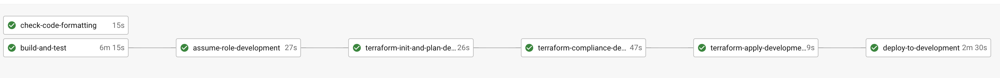
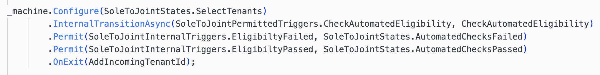
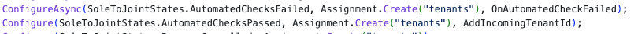

# Processes API

This API provides a workflow engine that will allow housing officers and other members of staff to initiate new workflows, upload documents, assign them and capture form information for the Manage My Home project.
View the API specification on [SwaggerHub](https://app.swaggerhub.com/apis-docs/Hackney/ProcessesApi/1.0.0). 

## Stack

- .NET Core v3.1 as a web framework.
- xUnit as a test framework.
- DynamoDb as a datastore.
- [Stateless](https://github.com/dotnet-state-machine/stateless) to implement the process state machine. ([See more](#process-engine-implementation))

### Setup

1. Install [Docker][docker-download].
2. Install [AWS CLI][AWS-CLI].
3. Clone this repository.
4. Open it in your IDE.

## Contributing

### Branching Strategy

This project utilises a Trunk-Based Development workflow. To see more information about this strategy, please refer to [this page on our API Playbook](https://playbook.hackney.gov.uk/API-Playbook/branching_strategies). 

#### Development



Automated tests (xUnit) & code linters are run on each push to any feature branch to ensure the code is of good quality. We use a pull request workflow, where changes are made on a branch and are approved by one or more other maintainers before the developer can merge into `master` branch.

Once a PR is approved and merged to the `master` branch, the application is deployed to development automatically, where we confirm that our latest changes work well. 

#### Staging & Production

To deploy to staging or production, we create a PR from the `master` branch to the `release` branch. Once this is approved, the application is deployed to staging automatically.
We manually confirm a production deployment in the CircleCI workflow once we're happy with our changes in staging.

### Creating a Pull Request

To help with making changes to code easier to understand when being reviewed, we've added a PR template.
When a new PR is created on a repo that uses this API template, the PR template will automatically fill in the `Open a pull request` description textbox.
The PR author can edit and change the PR description using the template as a guide.

## Development

To serve the application, run it using your IDE of choice. We use Visual Studio CE and JetBrains Rider on Mac.

### Using DynamoDb
To use a local instance of DynamoDb, this will need to be installed. This is most easily done using [Docker](https://www.docker.com/products/docker-desktop).
Run the following command, specifying the local path where you want the container's shared volume to be stored.
```
docker run --name dynamodb-local -p 8000:8000 -v <PUT YOUR LOCAL PATH HERE>:/data/ amazon/dynamodb-local -jar DynamoDBLocal.jar -sharedDb -dbPath /data
```

If you would like to see what is in your local DynamoDb instance using a simple gui, then [this admin tool](https://github.com/aaronshaf/dynamodb-admin) can do that.

The application can also be served locally using docker:
1.  Add you security credentials to AWS CLI.
```sh
$ aws configure
```
2. Log into AWS ECR.
```sh
$ aws ecr get-login --no-include-email
```
3. Build and serve the application. It will be available in the port 3000.
```sh
$ make build && make serve
```

### Configuring Hackney NuGet Packages
At Hackney, we have created NuGet Packages to prevent duplication of common code when implementing our APIs. These NuGet packages store the common code that can be used in relevant projects.
For full details on the features implemented in our packages please read [this ReadMe](https://github.com/LBHackney-IT/lbh-core/blob/release/README.md).

#### Using the packages
For full details on how to use the package(s) within this repository please read [this wiki page](https://github.com/LBHackney-IT/lbh-core/wiki/Using-the-package(s)-from-the-Hackney.Core-repository).


### Testing

#### Running the tests

```sh
$ make test
```

or

```sh
$ docker-compose up processes-api-test
```

#### Agreed Testing Approach
- Use xUnit, FluentAssertions and Moq
- Always follow a TDD approach
- Tests should be independent of each other
- Gateway tests should interact with a real test instance of the database
- Test coverage should never go down
- All use cases should be covered by E2E tests
- Optimise when test run speed starts to hinder development
- Unit tests and E2E tests should run in CI
- Test database schemas should match up with production database schema
- Have integration tests which test from the PostgreSQL database to API Gateway

See more: https://playbook.hackney.gov.uk/API-Playbook/tdd

## Process Engine Implementation

We use the [Stateless](https://github.com/dotnet-state-machine/stateless) NuGet package as a lightweight state machine. This means that this API's structure differs slightly from the [Base API template](https://github.com/LBHackney-IT/lbh-base-api).

### How to amend an existing workflow:
1. If adding a new state or trigger to an existing process workflow, update the constants file with your new values. (In [ProcessesApi/V1/Domain](./ProcessesApi/V1/Domain)).
2. Update the [SetUpStates](#2---overriding-setupstates) method in the specific service class (in ProcessesApi/V1/Services) according to the new business logic. 
   - This could include adding new [Internal Transitions](#using-internal-transitions) if the API needs to carry out any logic before determining the next state.
   - This could include adding [State Transition Actions](#using-state-transition-actions), which are functions that run on state transitions (e.g. firing ProcessUpdated Events)
3. Update relevant tests (Should normally just be the Service tests & E2E tests)

### How to add a new process workflow:
1. Update the ProcessName enum (In [ProcessesApi/V1/Domain/Enums.cs](./ProcessesApi/V1/Domain/Enums.cs)) to add the new process name.
2. Create a constants file for the states and triggers used in your process.
3. Create a new Service that is derived from the ProcessService base class & implement your steps. See instructions [here](#implementing-a-new-process-service-using-stateless).
4. Update the `ConfigureProcessServices` function (In [ProcessesApi/V1/ServiceCollectionExtensions.cs](./ProcessesApi/V1/ServiceCollectionExtensions.cs)) to add a new case to the switch statement, which will return your new Service.

**Remember to create & update tests as & when necessary**

-----

### Implementing a new Process Service using Stateless
See the stateless documentation [here](https://github.com/dotnet-state-machine/stateless).

#### 1 - Creating the class
Create a new class derived from the ProcessService base class. In the constructor, add this line: 

```C#
_permittedTriggersType = typeof(**<SOME_TYPE>**);
```

With **`<SOME_TYPE>`** being the name of the constant class that you created that stores all permitted triggers for your process.

#### 2 - Overriding `SetUpStates`
This method is specific for each process. Within this method, we define the states, what triggers they require based on the business logic, and what conditions need to be met to move to the next state. It should be overridden from the virtual method in the ProcessService base case.

##### Using Internal Transitions
Internal Transitions are used in this API when it needs to do some logic using the data from the request, then update the state based on the result. 

For example, in the automated eligibility check stage of the Sole To Joint process, the API makes various calls and checks, then updates the state to AutomatedChecksFailed or AutomatedChecksPassed.



#### 3 - Overriding `SetUpStateActions`
This method sets up custom actions that happen when a state transition happens. It consists of many [`Configure` & `ConfigureAsync`](#configure--configureasync) method calls. It should be overridden from the virtual method in the ProcessService base case.

##### Using State Transition Actions
State transitions actions are small that happen when a state transition is made. For example, publishing a ProcessClosed event when the process is closed.

-----
### Methods in the ProcessService base class
There are a number of helper methods in the ProcessService base class:

#### `Configure` & `ConfigureAsync`
These methods are normally called from the `SetUpStateActions` method. It updates the current state with the correct data, adds assignment data (placeholder for now), and runs any function passed as a parameter. 

Example: 



#### `TriggerStateMachine`
Allows the state machine to be triggered internally without updating the current state or previous states array. Mostly used in Internal State Transitions.

### `PublishProcessStartedEvent`, `PublishProcessUpdatedEvent` & PublishProcessClosedEvent`
Helper methods to publish events on state transitions.

### Process
The main method that is used by the UseCase to handle all interactions with the state machine. It does the following:

1. Sets up the current state if it is null to be `ApplicationInitialised`
2. Sets up the state machine
3. Calls the SetUpStates & SetUpStateActions methods to configure the process states, triggers and actions on the state machine
4. Checks if the trigger in the request is permitted & throws an exception if not (e.g. *Can not trigger `CheckDocuments` from `ApplicationInitialised`.*)
5. Triggers the state machine
6. Updates the process entity (from the database) with the new current state.

## Contacts

### Active Maintainers

- **Selwyn Preston**, Lead Developer at London Borough of Hackney (selwyn.preston@hackney.gov.uk)
- **Mirela Georgieva**, Lead Developer at London Borough of Hackney (mirela.georgieva@hackney.gov.uk)

### Other Contacts

- **Rashmi Shetty**, Product Owner at London Borough of Hackney (rashmi.shetty@hackney.gov.uk)

[docker-download]: https://www.docker.com/products/docker-desktop
[universal-housing-simulator]: https://github.com/LBHackney-IT/lbh-universal-housing-simulator
[AWS-CLI]: https://aws.amazon.com/cli/
